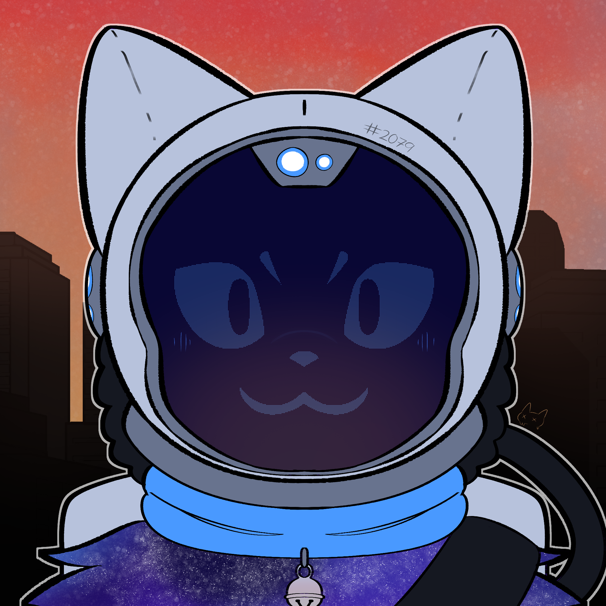

  
  <h1>Hi there, I'm Dinesh! 👋</h1>
  <h3>A Theoretical CS Enthusiast | Fullstack Developer | Linux Explorer 🐧</h3>

  
  
  

  

---

### 🚀 About Me  

- 🎓 **Theoretical CS student @ PSG Tech**.  
- 💻 Fullstack Developer transitioning to an **SDE role**.  
- 🌱 Currently exploring **systems design**, **DevOps**, and **Linux systems**.  
- 🎧 When I'm not coding, you’ll find me listening to music or on Netflix. 

---

### 🛠️ Languages, Toolkits & Wizardry  

  &nbsp;
  &nbsp;
  &nbsp;
   &nbsp;
  &nbsp;
&nbsp;
  &nbsp;
  &nbsp;
  &nbsp;
  &nbsp;
  &nbsp;
  &nbsp;
  &nbsp;
  &nbsp;
  
  

---

### 📊 My GitHub Stats  

  
   
  

---

### 🌟 Let's Connect  

  
  
  

